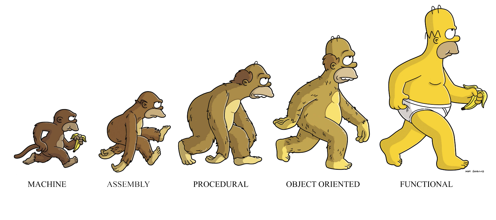
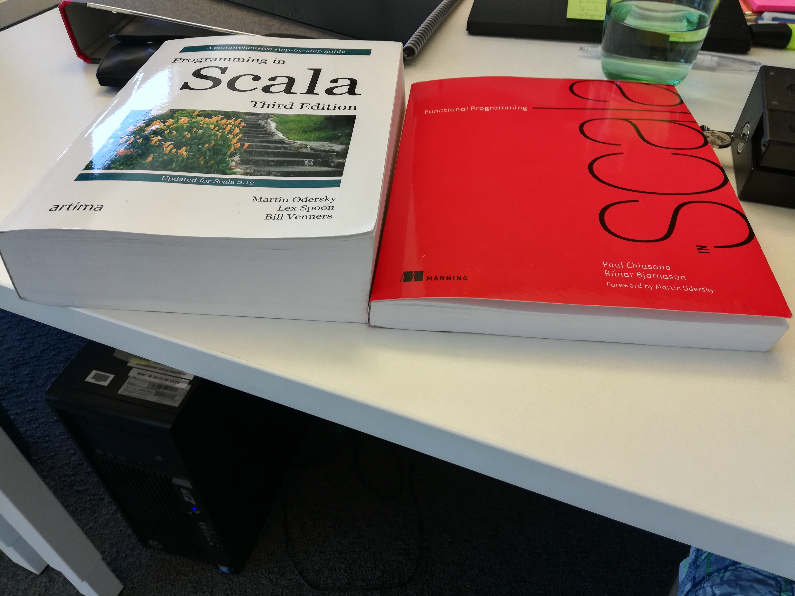
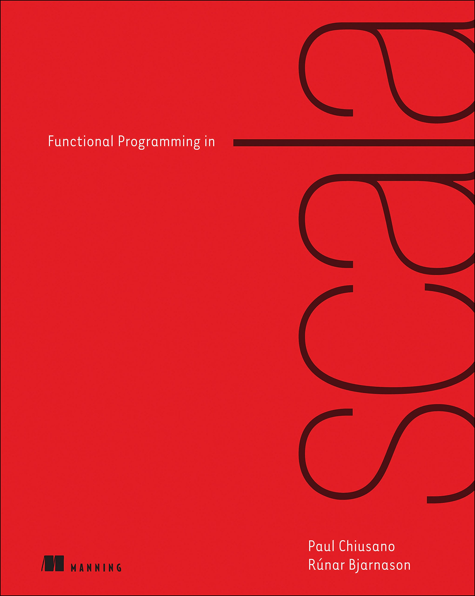
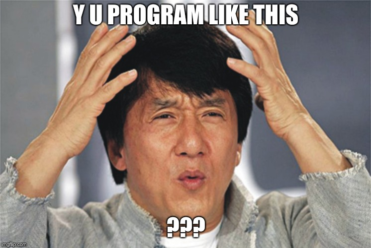
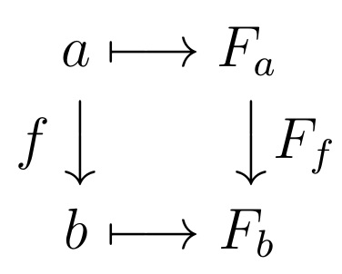
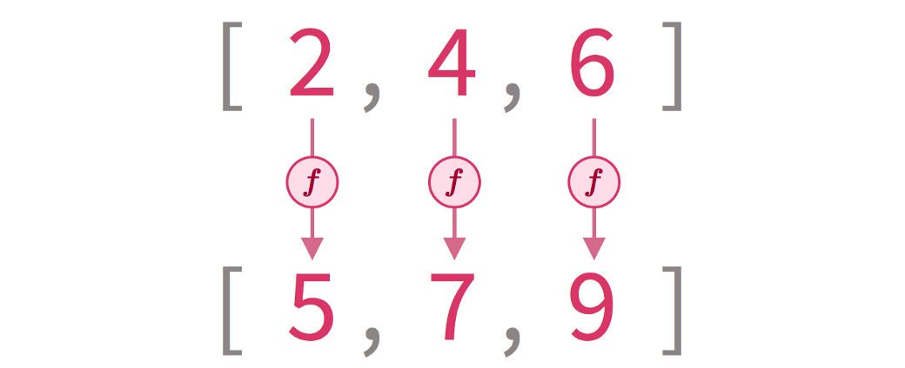
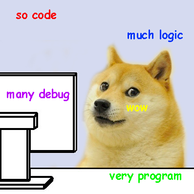
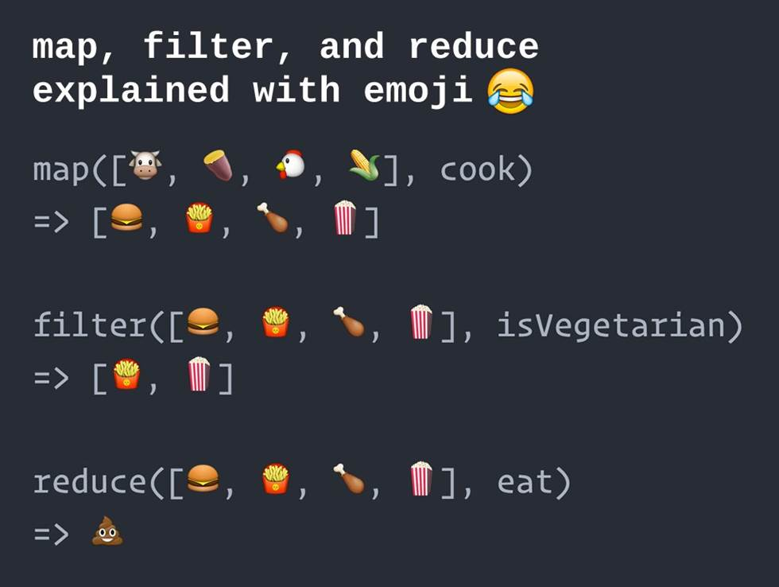

Referential Transparency
========================================================================

For simple and robust code
-----

June 8, 2018

Dr. **Bijan** Chokoufe Nejad

 <!-- .element: class="fragment" -->

Note:
- Welcome everyone
- Say who you are

---
Outline
------------------------------------------------------------------------
1. Motivation and Definition

1. Hands-on Examples and Utilities

1. HTTP Proxy as Case Study for Exception Handling

1. Outlook and Summary

---
Disclaimer and further reading
------------------------------------------------------------------------
A lot of this talk is directly from <mark>the red book</mark>

("Functional Programming in Scala")

  
Code examples will be in Scala but <mark>ideas apply in any language</mark>

Note:

---
Motivation
------------------------------------------------------------------------
What is `x`, `r1` and `r2` in these examples?

<iframe src="data:text/html;charset=utf-8,%3Cbody%3E%3Cscript%20src%3D%22https%3A%2F%2Fgist.github.com%2Fbijancn%2F2efd68921433fa90e959722834d11223.js%22%3E%3C%2Fscript%3E%3C%2Fbody%3E" height=130 width=370></iframe>
 
vs
 
 
<iframe src="data:text/html;charset=utf-8,%3Cbody%3E%3Cscript%20src%3D%22https%3A%2F%2Fgist.github.com%2Fbijancn%2Ff3b4dfe9f0b05c955d6dc65cd9a29f0d.js%22%3E%3C%2Fscript%3E%3C%2Fbody%3E" height=130 width=570></iframe>

---
Motivation
------------------------------------------------------------------------
Or what is `x` in this expression?

<iframe src="data:text/html;charset=utf-8,%3Cbody%3E%3Cscript%20src%3D%22https%3A%2F%2Fgist.github.com%2Fbijancn%2F6a71a0131926b679dd3ae1b95b1deec7.js%22%3E%3C%2Fscript%3E%3C%2Fbody%3E" height=110 width=570></iframe>

<mark>Equational reasoning</mark> would suggest
`   0 = 1`  

  

<!-- .element: class="fragment" -->

  *(Because it works like that on the lowest level)*

  <mark>Is there not a cleaner way?</mark>

  *(Yes there is)*

<!-- .element: class="fragment" -->

<!-- .element: class="fragment" -->

<!-- .element: class="fragment" -->

---
What is referential transparency (RT)?
------------------------------------------------------------------------
 
An expression `e` is <mark>referentially transparent</mark> if, for all programs
`p`, all occurrences of `e` in `p` can be replaced by the result of evaluating
`e` without affecting the meaning of `p`.
 
 

We will refer to this also as the <mark>substitution model</mark>.
 
 

A function `f` is <mark>pure</mark> if the expression `f(x)` is referentially
transparent for all referentially transparent `x`.

---
An example for the substitution model
------------------------------------------------------------------------
<iframe src="data:text/html;charset=utf-8,%3Cbody%3E%3Cscript%20src%3D%22https%3A%2F%2Fgist.github.com%2Fbijancn%2F195b05b06f507f6c9e39389ff72e2240.js%22%3E%3C%2Fscript%3E%3C%2Fbody%3E" height=170 width=770></iframe> 
Let's try to substitute

<iframe src="data:text/html;charset=utf-8,%3Cbody%3E%3Cscript%20src%3D%22https%3A%2F%2Fgist.github.com%2Fbijancn%2Fe937a868ec7dcdafe615e97f24f16399.js%22%3E%3C%2Fscript%3E%3C%2Fbody%3E" height=150 width=770></iframe> 
⚡⚡⚡

<!-- .element: class="fragment" -->

*(Normally you don't have to substitute to see if code is RT or not but
formalizing it allows to proof it.)*
<!-- .element: class="fragment" -->

---
What isn't RT?
------------------------------------------------------------------------
- <mark>Modifying</mark> a variable
- <mark>Modifying</mark> a data structure in place
- <mark>Setting</mark> a field on an object
- <mark>Throwing</mark> an exception or halting with an error
- `Printing` to the console or reading user input
- `Reading` from or writing to a file
- `Drawing` on the screen

Does that mean we can't interact with the real world?

How do we do anything useful?

**Spoiler Alert**: The idea is to <mark>push side effects to the
boundary</mark> of your program and then handle them there
<mark>explicitly</mark>

 <!-- .element: class="fragment" -->

Note:

---
Benefits of RT
------------------------------------------------------------------------
<mark>Pure functions</mark> are
- easier to test
- reuse
- compose
- generalize
- parallelize
- reason about locally
- much less prone to bugs
  

<mark>Functional programming (FP)</mark> is the programming paradigm
that builds on the <mark>core idea of RT</mark>

---
What else does that mean for us in practice?
------------------------------------------------------------------------
RT enables <mark>equational reasoning</mark> about programs  
through the substitution model ⇨

You can <mark>refactor confidently</mark> and relentlessly!

<mark>Combined with a strongly typed language</mark>, the signature of a pure
function already tells you often what it does

 <!-- .element: class="fragment" -->

---
Bringing it to practice
------------------------------------------------------------------------

---
A coffee shop with side effects
------------------------------------------------------------------------
<iframe src="data:text/html;charset=utf-8,%3Cbody%3E%3Cscript%20src%3D%22https%3A%2F%2Fgist.github.com%2Fbijancn%2Fef32b11b397b98c3b427043c013fba66.js%22%3E%3C%2Fscript%3E%3C%2Fbody%3E" height=240 width=770></iframe>

Think about <mark>how to test this</mark>: 
We don't want to charge actual money every time

Think about <mark>how to avoid multiple calls</mark> for two coffees

 <!-- .element: class="fragment" -->

What happens when we have <mark>no connection?</mark>

The type signature pretends `Coffee` creation and  
payment *never fails* ⇨ <mark>can't be RT</mark>

 <!-- .element: class="fragment" -->

---
A coffee shop without side effects
------------------------------------------------------------------------
We can <mark>separate concerns</mark> (creating the coffee doesn't have to be coupled to
calling the credit card company) and return `Charge`s instead of relying on side
effects

<iframe src="data:text/html;charset=utf-8,%3Cbody%3E%3Cscript%20src%3D%22https%3A%2F%2Fgist.github.com%2Fbijancn%2F36c4f7ab1ffd5aad9a47dcfa5b0dbda6.js%22%3E%3C%2Fscript%3E%3C%2Fbody%3E" height=250 width=770></iframe> 

Enjoy how <mark>trivial</mark> it is <mark>to test</mark> this <mark>without mocking</mark>
<iframe src="data:text/html;charset=utf-8,%3Cbody%3E%3Cscript%20src%3D%22https%3A%2F%2Fgist.github.com%2Fbijancn%2F43391b7c6b85ecb83df2b408bd38a3b7.js%22%3E%3C%2Fscript%3E%3C%2Fbody%3E" height=250 width=770></iframe> 

 <!-- .element: class="fragment" -->

---
Extra benefits
------------------------------------------------------------------------
<mark>Pushing side effects to the boundary</mark>  
<mark>makes the core more composable</mark>

E.g. it allows to write `buyCoffees` that combines the charges to the
same `CreditCard` reusing `buyCoffee`:

<iframe src="data:text/html;charset=utf-8,%3Cbody%3E%3Cscript%20src%3D%22https%3A%2F%2Fgist.github.com%2Fbijancn%2Fb2551034a6458e928ca9e9a1744ade50.js%22%3E%3C%2Fscript%3E%3C%2Fbody%3E" height=210 width=800></iframe>

We already used two extremely useful high-level List methods above: `map` (~
*homomorphism*) and  
`reduce` (similar to `fold` and ~ *catamorphism*).

 <!-- .element: class="fragment" -->

---
Mapping instead of looping
------------------------------------------------------------------------
<iframe src="data:text/html;charset=utf-8,%3Cbody%3E%3Cscript%20src%3D%22https%3A%2F%2Fgist.github.com%2Fbijancn%2Fa387cbdd838c35a04cb1b7be55710df7.js%22%3E%3C%2Fscript%3E%3C%2Fbody%3E" height=300 width=500></iframe>

🙈

---
Mapping instead of looping
------------------------------------------------------------------------
`map` is *the way* to transform values of one category to another
  

<iframe src="data:text/html;charset=utf-8,%3Cbody%3E%3Cscript%20src%3D%22https%3A%2F%2Fgist.github.com%2Fbijancn%2F5182658bf2983c418576368ad37696a8.js%22%3E%3C%2Fscript%3E%3C%2Fbody%3E" height=170 width=370></iframe>
 
`F` can be `List` or `Array` or `Option` or `Future` or anything for which we
can define `map`

Or graphically

---
Mapping instead of looping
------------------------------------------------------------------------
  

<iframe src="data:text/html;charset=utf-8,%3Cbody%3E%3Cscript%20src%3D%22https%3A%2F%2Fgist.github.com%2Fbijancn%2F081b0482fd6287eb42ea8308f6d7dc80.js%22%3E%3C%2Fscript%3E%3C%2Fbody%3E" height=150 width=400></iframe>
 
 
No off-by-one errors, 
run-away loop or  
`IndexOutOfBoundsException` <mark>possible</mark>

 
 

👌
😎

---
Folding instead of looping
------------------------------------------------------------------------

<iframe src="data:text/html;charset=utf-8,%3Cbody%3E%3Cscript%20src%3D%22https%3A%2F%2Fgist.github.com%2Fbijancn%2Fa397f5d2ab7399c9a7f8c10cecb63ae8.js%22%3E%3C%2Fscript%3E%3C%2Fbody%3E" height=320 width=800></iframe>

🙈

 <!-- .element: class="fragment" -->

---
Folding instead of looping
------------------------------------------------------------------------
`fold` is the generic way to go from one data structure to a summary value

<iframe src="data:text/html;charset=utf-8,%3Cbody%3E%3Cscript%20src%3D%22https%3A%2F%2Fgist.github.com%2Fbijancn%2F327129af054fbfc80bfb5db9ebebd73d.js%22%3E%3C%2Fscript%3E%3C%2Fbody%3E" height=220 width=500></iframe>
`A` and `B` can also be the same

---
Folding instead of looping
------------------------------------------------------------------------
<iframe src="data:text/html;charset=utf-8,%3Cbody%3E%3Cscript%20src%3D%22https%3A%2F%2Fgist.github.com%2Fbijancn%2F599717764575b8df5f312b3139799786.js%22%3E%3C%2Fscript%3E%3C%2Fbody%3E" height=240 width=500></iframe>

No more loop mechanics or mutable state involved 
👌

Still not really expressive. 
There might be more cases where we  
<mark>check predicates to reduce</mark>:

<iframe src="data:text/html;charset=utf-8,%3Cbody%3E%3Cscript%20src%3D%22https%3A%2F%2Fgist.github.com%2Fbijancn%2F4fc90db522c4b12a8f69ba3c5683e390.js%22%3E%3C%2Fscript%3E%3C%2Fbody%3E" height=220 width=500></iframe>

😎

 <!-- .element: class="fragment" -->

---
Folding instead of looping
------------------------------------------------------------------------
`Foldables` have a range of similar semantics that can be implemented when a
datatype has `fold`  (omitting `(fa: F[A])`)
<iframe src="data:text/html;charset=utf-8,%3Cbody%3E%3Cscript%20src%3D%22https%3A%2F%2Fgist.github.com%2Fbijancn%2F537da894e118c04e9a24c532786ad8d0.js%22%3E%3C%2Fscript%3E%3C%2Fbody%3E" height=300 width=500></iframe>

---
In other words
------------------------------------------------------------------------

---
How to do exception handling without exceptions
------------------------------------------------------------------------

---
Let's create an HTTP proxy
------------------------------------------------------------------------

Bob 👨‍🎓
<iframe src="data:text/html;charset=utf-8,%3Cbody%3E%3Cscript%20src%3D%22https%3A%2F%2Fgist.github.com%2Fbijancn%2F58e5500ffcb7b89f69fad9b10c22797b.js%22%3E%3C%2Fscript%3E%3C%2Fbody%3E" height=150 width=500></iframe>
Easy, right? Let's party!  🍺 🏖️

Alice 👩‍💻

loadNumberOfItems("foo.bar") shouldBe a [Int]
 
// InvalidUrlException
 
loadNumberOfItems("http://google.com") shouldBe a [Int]
 
// InvalidPayloadException
 
loadNumberOfItems("http://actual.server.endpoint.com/number") shouldBe a [Int]
 
// ConnectionException
 
// ParsingException
 
// ClassCastException

💥 😠 💥

 <!-- .element: class="fragment" -->

---
Back to the drawing board
------------------------------------------------------------------------
- Represent <mark>failures</mark> or <mark>partiality</mark> with
    <mark>ordinary values</mark>
- The return <mark>type</mark> should indicate what can go wrong, so the compiler can
    remind us to handle all cases
- Think `C` <mark>return codes</mark> on steroids
- Trying to use <mark>sentinal values</mark> like `NaN` might not be an option, allow
    silent propagation and result in nongeneric boilerplate

---
Either or Option
------------------------------------------------------------------------
There are two common, minimal wrappers  to indicate <mark>possible failures</mark>:
 
 

`Option` is like a list with at most one element
- `Option` is either `None` or `Some(x)`
- `map` on an Option adds the next computation step when there is
    `Some`thing
- `map` allows us <mark>lift</mark> any function that goes `A => B` to a
  function `Option[A] => Option[B]`. Thus we don't have to entangle arguments
  with `Option`
 
 
 

`Either` is like `Option` but instead of `None` it allows to add
<mark>what went wrong</mark>

---
Let's create an HTTP proxy
------------------------------------------------------------------------
Bob 👨‍🎓 😩
<iframe src="data:text/html;charset=utf-8,%3Cbody%3E%3Cscript%20src%3D%22https%3A%2F%2Fgist.github.com%2Fbijancn%2F7127b21eaf06280d617d24173dd0e8a7.js%22%3E%3C%2Fscript%3E%3C%2Fbody%3E" height=150 width=500></iframe>

<iframe src="data:text/html;charset=utf-8,%3Cbody%3E%3Cscript%20src%3D%22https%3A%2F%2Fgist.github.com%2Fbijancn%2Fe93151bac653cb3b0306dd515952d699.js%22%3E%3C%2Fscript%3E%3C%2Fbody%3E" height=350 width=800></iframe>

---
Let's create an HTTP proxy
------------------------------------------------------------------------
👨‍🎓  👩‍💻
<iframe src="data:text/html;charset=utf-8,%3Cbody%3E%3Cscript%20src%3D%22https%3A%2F%2Fgist.github.com%2Fbijancn%2F29e4d76c3987f5713a430ebf6f7948fc.js%22%3E%3C%2Fscript%3E%3C%2Fbody%3E" height=250 width=800></iframe>

loadNumberOfItems(&quot;foo.bar&quot;).unsafeRunSync
 
&nbsp;&nbsp;shouldBe Left(InvalidUrl) 
 
loadNumberOfItems(&quot;http://google.com&quot;).unsafeRunSync
 
&nbsp;&nbsp;shouldBe Left(InvalidJson)
 
loadNumberOfItems(&quot;http://actual.server.endpoint.com/number&quot;).unsafeRunSync
 
&nbsp;&nbsp;shouldBe Right(42)

😎 🍾 🥂

---
Related topics we left out
------------------------------------------------------------------------
- <mark>Applicatives & Monads</mark>
- <mark>Semigroups</mark>
- <mark>Strictness & Laziness</mark>
- <mark>Encapsulating any side effects</mark> in RT types (`IO`)
 
 

- How <mark>typeclasses</mark> and <mark>ad-hoc polymorphism</mark> works in Scala
- <mark>Variance</mark> (Covariant, Contravariant and Invariant)

---
Summary
------------------------------------------------------------------------
- <mark>Referential transparency (RT)</mark> is the basis  
  for <mark>functional programming</mark>
- RT is by definition the only way to allow for 
  <mark>relentless refactoring</mark>
- RT forces you to make any assumptions <mark>explicit</mark>
- FP allows you to express anything in an RT way
- You can make your code more transparent in any language...

  ...but it's simpler in some then others 😎
  
Note:
- Referential transparency makes <mark>parallel execution</mark> far easier
- All <mark>side-effects can be wrapped</mark> in typed objects
